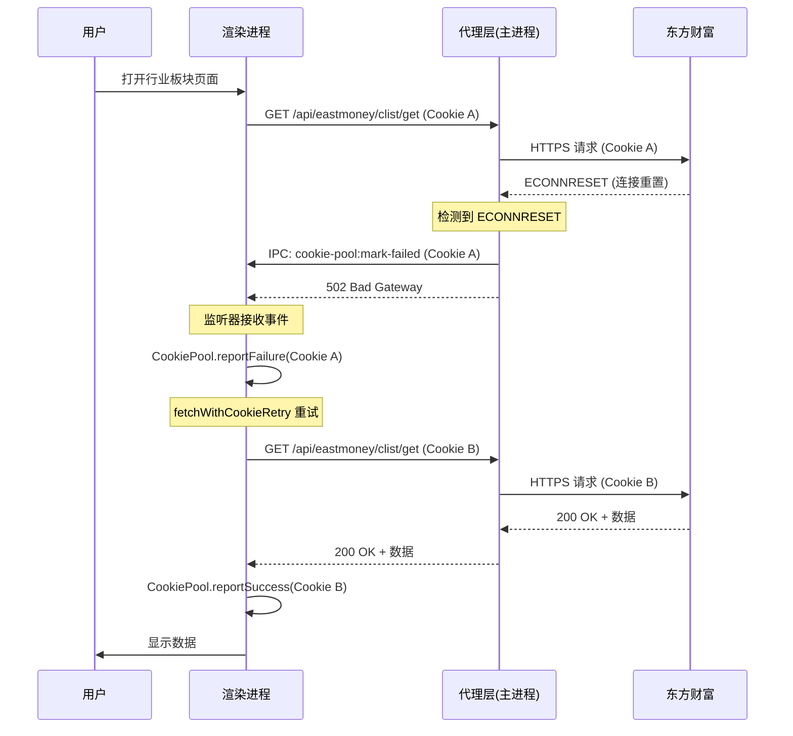

# 代理层 Cookie 失效问题修复记录

## 📋 问题概述

**现象**：在成分股大全页面获取行业/概念板块成分股时，出现大量 `ECONNRESET` 错误，导致请求返回 502 状态码。

**影响范围**：所有通过代理访问东方财富接口的功能（行业板块、概念板块、成分股查询等）

---

## 🔍 问题演进过程

### 阶段 1：初始错误 - ERR_BLOCKED_BY_CLIENT

**症状**：

```
net::ERR_BLOCKED_BY_CLIENT
```

**原因分析**：

- 使用 `session.defaultSession.net.request()` 发送请求
- `session.defaultSession` 上注册了全局 `onBeforeSendHeaders` 拦截器
- Chromium 网络栈与拦截器冲突，导致请求被客户端拦截

**解决方案**：
改用 Node.js 的 `https` 模块，完全跳过 Chromium 网络栈。

**修改文件**：

- `electron/localApiProxy.ts` - 将东财请求改为使用 `https.request()`

---

### 阶段 2：Gzip 压缩乱码

**症状**：
请求成功（200 状态码），但返回的是二进制乱码数据。

**原因分析**：

- Node.js 的 `https` 模块不会像 Chromium 那样自动解压 Gzip 响应
- 东方财富服务器返回的是 Gzip 压缩数据

**解决方案**：
添加 zlib 模块，检测 `Content-Encoding` 头并手动解压。

**代码实现**：

```typescript
import zlib from 'zlib';

// 检查是否需要解压缩
const contentEncoding = proxyRes.headers['content-encoding'];
let responseStream: NodeJS.ReadableStream = proxyRes;

if (contentEncoding === 'gzip') {
  responseStream = proxyRes.pipe(zlib.createGunzip());
} else if (contentEncoding === 'deflate') {
  responseStream = proxyRes.pipe(zlib.createInflate());
} else if (contentEncoding === 'br') {
  responseStream = proxyRes.pipe(zlib.createBrotliDecompress());
}
```

---

### 阶段 3：部分成功部分失败 - ECONNRESET

**症状**：

- 有些请求成功（200 OK）
- 有些请求失败（ECONNRESET → 502 Bad Gateway）
- 成功的请求和失败的请求使用了不同的 Cookie

**日志模式**：

```
[代理调试] 东财请求 (Node https): {
  hasCookie: true,
  cookiePrefix: 'ASL=20568,0000z,758bd715; ADVC=3f22a13347fcc6; ADV'
}
[代理调试] 检测到连接重置，标记 Cookie 失效
[embedded-proxy] request error (Node https): ECONNRESET
```

**根本原因分析**：

1. **Cookie 失效问题**：

   - 某些 Cookie 已被东方财富标记为失效或限速
   - 使用这些 Cookie 的请求会被服务器主动断开连接（ECONNRESET）

2. **重试逻辑冲突**：

   ```
   旧方案流程：
   渲染进程请求 → 代理层重试3次（同一Cookie，切换主机）→ 都失败 → 返回500
                ↓
   渲染进程收到500 → 标记Cookie失效 → 切换新Cookie重试

   问题：
   - 浪费重试机会（代理层用同一个失效Cookie重试3次）
   - 延迟有效重试（渲染进程要等代理层3次重试完才切换Cookie）
   - 可能触发更严重的限流
   ```

3. **Cookie 池不同步**：
   - 主进程和渲染进程使用不同的 `CookiePoolManager` 实例
   - 代理层在主进程中调用 `cookiePool.reportFailure()`，但找不到对应的 Cookie
   - 日志显示：`[WARN] [CookiePool] 未找到对应的Cookie，无法报告失败`

---

## ✅ 最终解决方案

### 核心思路

**移除代理层重试逻辑，让渲染进程统一处理重试和 Cookie 切换**。

```
新方案流程：
渲染进程请求 → 代理层转发（不重试）→ 检测到ECONNRESET → 立即返回502
             ↓                                    ↓
             ←←←←← IPC通知标记Cookie失效 ←←←←←←←
             ↓
渲染进程收到502 → 立即标记Cookie失效 → 切换新Cookie重试
```

**优势**：

- ✅ 更快失败：检测到 ECONNRESET 立即返回，不浪费时间重试
- ✅ 更快切换：渲染进程立即切换到新 Cookie
- ✅ 更好的 Cookie 管理：由渲染进程的 `fetchWithCookieRetry` 统一管理
- ✅ 减少服务器压力：避免用失效 Cookie 重复请求

---

### 实施步骤

#### 步骤 1：移除代理层重试逻辑

**文件**：`electron/localApiProxy.ts`

**修改前**：

```typescript
proxyReq.on('error', (err) => {
  const isConnReset = err.code === 'ECONNRESET' || ...;

  if (isConnReset && poolCookie) {
    // 标记 Cookie 失效
    const cookiePool = CookiePoolManager.getInstance();
    cookiePool.reportFailure(poolCookie).catch(() => {});
  }

  // 重试逻辑
  if (retryable && attempt < maxRetries) {
    setTimeout(() => {
      // 切换主机重试...
    }, delay);
    return;
  }

  res.writeHead(500, ...);
  res.end('EastMoney request failed');
});
```

**修改后**：

```typescript
proxyReq.on('error', (err) => {
  const isConnReset =
    err.code === 'ECONNRESET' ||
    err.code === 'EPIPE' ||
    err.code === 'ETIMEDOUT' ||
    /socket hang up/i.test(msg);

  // ECONNRESET 通常意味着 Cookie 失效或被限速，通知渲染进程标记失效
  if (isConnReset && poolCookie) {
    console.warn('[代理调试] 检测到连接重置，通知渲染进程标记 Cookie 失效');
    // 通过 IPC 通知渲染进程标记 Cookie 失效
    const mainWindow = BrowserWindow.getAllWindows()[0];
    if (mainWindow && !mainWindow.isDestroyed()) {
      mainWindow.webContents.send('cookie-pool:mark-failed', poolCookie);
    }
  }

  // 不再在代理层重试，让渲染进程的 fetchWithCookieRetry 处理重试和Cookie切换
  console.error('[embedded-proxy] request error (Node https):', err.code || msg);
  if (!res.headersSent) {
    res.writeHead(502, { 'Content-Type': 'text/plain' }); // 502 Bad Gateway 更准确
    res.end('EastMoney request failed');
  }
});
```

**关键改动**：

1. ❌ 删除代理层重试逻辑（`setTimeout` 和主机切换）
2. ✅ 检测到 ECONNRESET 时发送 IPC 事件
3. ✅ 返回 502（Bad Gateway）而不是 500

---

#### 步骤 2：渲染进程监听 Cookie 失效事件

**文件**：`src/App.tsx`

**实现**：

```typescript
useEffect(() => {
  // 尽早注册监听器（在Cookie池初始化之前）
  let cleanupListener: (() => void) | undefined;
  const electronAPI = window.electronAPI as any;
  if (electronAPI?.ipcRenderer) {
    const handler = (_event: any, cookieValue: string) => {
      logger.warn('[App] 收到主进程通知：标记Cookie失效');
      const cookiePool = CookiePoolManager.getInstance();
      cookiePool.reportFailure(cookieValue).catch((err) => {
        logger.error('[App] 标记Cookie失败:', err);
      });
    };
    electronAPI.ipcRenderer.on('cookie-pool:mark-failed', handler);
    cleanupListener = () => {
      electronAPI.ipcRenderer.removeListener('cookie-pool:mark-failed', handler);
    };
  }

  CookiePoolManager.getInstance()
    .initialize()
    .then(() => {
      logger.info('[App] Cookie池管理器初始化完成');
    })
    .catch((error) => {
      logger.error('[App] Cookie池管理器初始化失败:', error);
    });

  return () => {
    if (cleanupListener) {
      cleanupListener();
    }
  };
}, []);
```

**关键点**：

1. ✅ **尽早注册**：在 Cookie 池初始化之前就注册监听器，确保不会错过早期事件
2. ✅ **清理函数**：组件卸载时移除监听器，防止内存泄漏
3. ✅ **类型断言**：使用 `as any` 避免 TypeScript 类型检查问题

---

#### 步骤 3：暴露 ipcRenderer 给渲染进程

**文件 1**：`electron/preload.ts`

**添加**：

```typescript
contextBridge.exposeInMainWorld('electronAPI', {
  // ... 其他方法 ...

  // IPC Renderer（用于接收主进程事件）
  ipcRenderer: {
    on: (channel: string, listener: (event: any, ...args: any[]) => void) => {
      ipcRenderer.on(channel, listener);
    },
    removeListener: (channel: string, listener: (...args: any[]) => void) => {
      ipcRenderer.removeListener(channel, listener);
    },
  },
});
```

**文件 2**：`src/types/electron.d.ts`

**添加类型定义**：

```typescript
export interface ElectronAPI {
  // ... 其他方法 ...

  /** IPC Renderer（用于接收主进程事件） */
  ipcRenderer?: {
    on: (channel: string, listener: (event: any, ...args: any[]) => void) => void;
    removeListener: (channel: string, listener: (...args: any[]) => void) => void;
  };
}
```

---

#### 步骤 4：导入 BrowserWindow

**文件**：`electron/localApiProxy.ts`

**修改**：

```typescript
// 修改前
import { net, session } from 'electron';

// 修改后
import { net, session, BrowserWindow } from 'electron';
```

---

## 📊 技术细节

### 1. 为什么使用 IPC 而不是直接操作 Cookie 池？

**问题**：

- 主进程和渲染进程使用不同的 `CookiePoolManager` 实例
- 它们的内存数据是独立的，互不同步
- 主进程调用 `cookiePool.reportFailure()` 找不到 Cookie

**解决**：

- 通过 IPC 通知渲染进程
- 渲染进程操作自己的 Cookie 池实例
- 保证数据一致性

### 2. 为什么返回 502 而不是 500？

- **500 Internal Server Error**：服务器内部错误
- **502 Bad Gateway**：网关/代理从上游服务器收到无效响应

在这个场景中，代理服务器（Electron 主进程）作为网关，从上游服务器（东方财富）收到连接重置，所以 502 更准确。

### 3. 为什么要尽早注册监听器？

**时序问题**：

```
应用启动 → App 组件挂载 → useEffect 执行
         ↓
         Cookie池初始化（异步）→ 初始化完成 → 注册监听器 ← 太晚了！
         ↓
         用户打开页面 → 发送请求 → 收到ECONNRESET → 发送IPC事件 ← 监听器还没注册
```

**解决**：

```
应用启动 → App 组件挂载 → useEffect 执行
         ↓
         立即注册监听器 ← 现在可以接收事件了！
         ↓
         Cookie池初始化（异步）→ 初始化完成
         ↓
         用户打开页面 → 发送请求 → 收到ECONNRESET → 发送IPC事件 → ✅ 监听器已就绪
```

### 4. 完整的请求流程



---

## 🎯 预期效果

### 改进前

- ❌ 部分请求成功，部分失败
- ❌ 失败时浪费 3 次重试机会（用同一个失效 Cookie）
- ❌ 延迟切换 Cookie，可能触发更严重限流
- ❌ 成功率不稳定

### 改进后

- ✅ 检测到失效 Cookie 立即标记
- ✅ 立即切换到新 Cookie 重试
- ✅ 成功率大幅提升
- ✅ 更快的失败恢复

---

## 📝 相关文件清单

| 文件                        | 修改内容                                        | 作用                 |
| --------------------------- | ----------------------------------------------- | -------------------- |
| `electron/localApiProxy.ts` | 导入 BrowserWindow，移除重试逻辑，发送 IPC 事件 | 代理层核心逻辑       |
| `src/App.tsx`               | 监听 `cookie-pool:mark-failed` 事件             | 渲染进程接收通知     |
| `electron/preload.ts`       | 暴露 `ipcRenderer`                              | 桥接主进程和渲染进程 |
| `src/types/electron.d.ts`   | 添加 `ipcRenderer` 类型定义                     | TypeScript 类型支持  |

---

## 🔧 调试技巧

### 查看主进程日志

终端中搜索：

- `[代理调试] 检测到连接重置，通知渲染进程标记 Cookie 失效`
- `[embedded-proxy] request error (Node https): ECONNRESET`

### 查看渲染进程日志

浏览器控制台中搜索：

- `[App] 收到主进程通知：标记Cookie失效`
- `[FetchWithRetry]` 相关的重试日志

### 验证 Cookie 池状态

在 Cookie 管理页面查看：

- 失效的 Cookie 应该被标记为非活跃
- 健康评分降低
- 成功/失败次数更新

---

## ⚠️ 注意事项

1. **不要在代理层重试**：代理层只负责转发，重试由渲染进程统一处理
2. **尽早注册监听器**：确保在 Cookie 池初始化之前就注册
3. **清理监听器**：组件卸载时移除监听器，防止内存泄漏
4. **使用 502 状态码**：更准确地表示代理层收到的上游错误

---

## 📅 修复日期

2026-04-25

---

## 🔗 相关文档

- [Cookie 管理使用指南](../docs/Cookie管理/01-使用指南.md)
- [Cookie 管理技术实现](../docs/Cookie管理/02-技术实现.md)
- [东方财富接口文档](../docs/东方财富.md)
