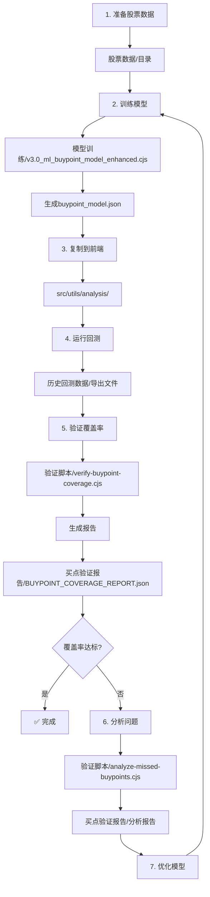

# 回测优化模块 - 目录说明

## 📁 目录结构

```
docs/回测优化/
├── README.md                          # 本文件 - 总览说明
├── 模型训练/                           # 机器学习模型相关文件
│   ├── README.md                      # 模型使用说明
│   ├── v3.0_ml_buypoint_model_enhanced.cjs  # 模型训练脚本（增强版）
│   ├── buypoint_model.json            # 最新训练的模型文件
│   ├── v3.0_buypoint_model_current.json      # 当前使用的模型
│   ├── MODEL_GUIDE.md                 # 模型使用指南
│   └── 其他分析脚本...                # 特征分析、聚类等脚本
├── 股票数据/                           # 28只股票的K线数据
│   ├── 三孚股份.txt
│   ├── 中衡设计.txt
│   └── ... (共28个文件)
├── 验证脚本/                           # 覆盖率验证和分析脚本
│   ├── verify-buypoint-coverage.cjs   # 买点覆盖率验证
│   ├── analyze-missed-buypoints.cjs   # 未覆盖买点分析
│   └── compare-covered-vs-missed.cjs  # 已覆盖vs未覆盖对比
├── 买点验证报告/                       # 验证结果和报告文档
│   ├── BUYPOINT_COVERAGE_REPORT.json  # 最新覆盖率报告
│   ├── ENSEMBLE_MODEL_REPORT.md       # 集成学习模型报告
│   ├── ZHONGHENG_FIX_REPORT.md        # 中衡设计修复报告
│   ├── MODEL_OPTIMIZATION_REPORT_PHASE_A.md  # 模型优化报告
│   └── ... (其他分析报告)
├── 历史回测数据/                       # 回测导出文件
│   ├── backtest_export_*.json         # 按时间排序的导出文件
│   └── README.md                      # 回测数据说明
└── 文档归档/                           # 其他相关文档
    ├── 回测买入信号优化方案.md         # 优化方案文档
    ├── 导出功能使用说明.md             # 导出功能指南
    └── 股票数据导出功能说明.md         # 数据导出说明
```

---

## 📚 各目录详细说明

### 1. 模型训练 (`模型训练/`)

**用途**: 存储所有与机器学习模型相关的文件

**核心文件**:

- `v3.0_ml_buypoint_model_enhanced.cjs` - 主训练脚本，支持多配置参数搜索
- `buypoint_model.json` - 最新训练生成的模型文件
- `v3.0_buypoint_model_current.json` - 前端当前使用的模型副本

**使用方法**:

```bash
cd docs/回测优化/模型训练
node v3.0_ml_buypoint_model_enhanced.cjs
```

**输出**: 训练完成后会生成`buypoint_model.json`，需要复制到`src/utils/analysis/`目录

---

### 2. 股票数据 (`股票数据/`)

**用途**: 存储 28 只测试股票的 K 线数据文件

**文件格式**: JSON 格式，包含`dailyLines`数组和`日期买点`标记

**文件列表**: 28 只股票，包括：

- 三孚股份、三维通信、中天科技、中衡设计
- 兆新股份、先导基电、利通电子、吉林化纤
- ... 等共 28 只

**数据来源**: 从历史回测系统导出

**注意事项**:

- 每个文件末尾有"日期买点："标记，标注手动识别的买点日期
- 训练脚本会自动解析这些日期作为正样本

---

### 3. 验证脚本 (`验证脚本/`)

**用途**: 验证模型覆盖率和分析未覆盖买点

**核心脚本**:

#### verify-buypoint-coverage.cjs

**功能**: 验证手动买点的模型覆盖率
**用法**:

```bash
cd docs/回测优化/验证脚本
node verify-buypoint-coverage.cjs
```

**输出**:

- 控制台显示每只股票的覆盖情况
- 生成`BUYPOINT_COVERAGE_REPORT.json`到`买点验证报告/`目录

#### analyze-missed-buypoints.cjs

**功能**: 分析未覆盖买点的 K 线特征
**用法**:

```bash
node analyze-missed-buypoints.cjs
```

**输出**:

- 提取未覆盖日期的技术指标
- 生成`MISSED_BUYPOINTS_ANALYSIS.json`

#### compare-covered-vs-missed.cjs

**功能**: 对比已覆盖和未覆盖买点的特征差异
**用法**:

```bash
node compare-covered-vs-missed.cjs
```

**输出**:

- 统计特征分布差异
- 生成`COVERED_VS_MISSED_COMPARISON.json`

---

### 4. 买点验证报告 (`买点验证报告/`)

**用途**: 存储所有验证结果和分析报告

**核心报告**:

#### ENSEMBLE_MODEL_REPORT.md

**内容**: 集成学习模型的实施方案和验证结果
**关键信息**:

- 双模型集成策略（Config_19 + Config_21 Full）
- OR 逻辑实现细节
- 100%覆盖率验证结果

#### ZHONGHENG_FIX_REPORT.md

**内容**: 中衡设计文件修复过程
**关键信息**:

- 文件损坏问题发现
- 修复步骤
- 重新训练流程

#### MODEL_OPTIMIZATION_REPORT_PHASE_A.md

**内容**: 模型参数优化详细报告
**关键信息**:

- 23 个配置的对比结果
- Config_21 达到 100%召回率
- 决策树规则分析

#### BUYPOINT_COVERAGE_REPORT.json

**内容**: 最新的覆盖率验证结果（JSON 格式）
**结构**:

```json
{
  "totalManualPoints": 78,
  "coveredPoints": 78,
  "missedPoints": 0,
  "stocks": [...]
}
```

---

### 5. 历史回测数据 (`历史回测数据/`)

**用途**: 存储回测系统的导出文件

**文件命名**: `backtest_export_YYYY-MM-DDTHH-MM-SS.json`

**使用方法**:

1. 在应用中运行全景回测
2. 点击"导出数据"按钮
3. 文件自动保存到此目录
4. 验证脚本会自动读取最新的导出文件

**注意事项**:

- 每次重新训练模型后，需要重新运行回测并导出
- 验证脚本会自动使用最新的导出文件（需在脚本中更新文件名）

---

### 6. 文档归档 (`文档归档/`)

**用途**: 存储其他相关文档

**包含文档**:

- **回测买入信号优化方案.md** - 整体优化方案和路线图
- **导出功能使用说明.md** - 如何导出回测数据
- **股票数据导出功能说明.md** - 股票数据导出功能详解

---

## 🔄 工作流程

### 完整优化流程



### 快速验证流程

```bash
# 1. 确保最新回测数据已导出
# （在应用中运行回测并导出）

# 2. 更新验证脚本中的文件名
# （编辑 verify-buypoint-coverage.cjs 第16-20行）

# 3. 运行验证
cd docs/回测优化/验证脚本
node verify-buypoint-coverage.cjs

# 4. 查看报告
cd ../买点验证报告
cat BUYPOINT_COVERAGE_REPORT.json
```

---

## 📊 当前状态

### 模型版本

- **当前模型**: 集成学习版（Ensemble_Config19_Config21）
- **组成**: Config_19 (depth=18) + Config_21 Full (depth=20)
- **集成策略**: OR 逻辑（任一模型识别即标记）
- **覆盖率**: **100%** (78/78 个手动买点)

### 训练数据

- **股票数量**: 28 只
- **正样本**: 78 个手动买点
- **负样本**: 1100 个（两个模型合计）
- **总样本**: 1253 个

### 性能指标

- **训练召回率**: 100%
- **训练精确率**: 100%
- **实际覆盖率**: 100%
- **F1 分数**: 1.00

---

## 🛠️ 常用命令

### 训练模型

```bash
cd docs/回测优化/模型训练
node v3.0_ml_buypoint_model_enhanced.cjs
```

### 验证覆盖率

```bash
cd docs/回测优化/验证脚本
node verify-buypoint-coverage.cjs
```

### 分析未覆盖买点

```bash
cd docs/回测优化/验证脚本
node analyze-missed-buypoints.cjs
```

### 对比已覆盖 vs 未覆盖

```bash
cd docs/回测优化/验证脚本
node compare-covered-vs-missed.cjs
```

---

## 📝 维护建议

### 定期任务

1. **每月验证一次覆盖率** - 确保模型效果稳定
2. **检查股票数据完整性** - 确认所有文件正常
3. **备份重要报告** - 特别是覆盖率 100%的报告

### 模型更新时

1. 重新训练模型
2. 复制新模型到`src/utils/analysis/`
3. 更新模型元数据（版本号、训练日期等）
4. 重新运行回测并导出
5. 验证覆盖率
6. 更新本报告中的"当前状态"部分

### 新增股票时

1. 导出新股票的 K 线数据到`股票数据/`目录
2. 在训练脚本中添加新股票配置
3. 重新训练模型
4. 验证新股票的覆盖率

---

## 🔗 相关文档

- [模型训练/README.md](./模型训练/README.md) - 模型详细说明
- [历史回测数据/README.md](./历史回测数据/README.md) - 回测数据说明
- [买点验证报告/README.md](./买点验证报告/README.md) - 验证报告索引

---

**最后更新**: 2026-05-06  
**整理者**: AI Assistant  
**当前覆盖率**: 100% ✅
